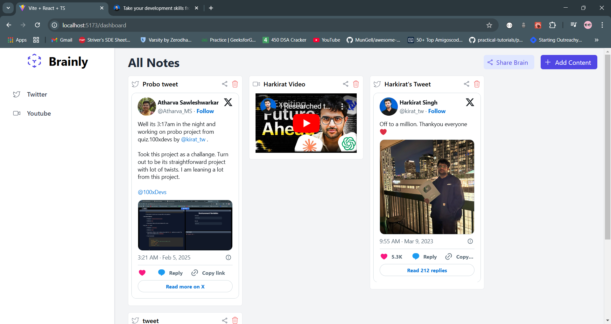

# Content Management API

## Overview

A Node.js Express application for managing user content with authentication and sharing features.

## Technologies

- Express.js
- Mongoose
- TypeScript
- JSON Web Token (JWT) for authentication

## Features

- User authentication
- CRUD operations for content
- Content sharing via generated hash links
- User-specific content management

## Setup

### Prerequisites

- Node.js
- MongoDB

### Installation

1. Clone the repository
2. Install dependencies: `npm install`
3. Set up environment variables
4. Run the application: `npm start`

## API Endpoints

### Authentication

- `POST /api/v1/auth/register`: User registration
- `POST /api/v1/auth/login`: User login

### Content Management

- `GET /api/v1/content`: Retrieve user's content
- `POST /api/v1/content`: Create new content
- `PUT /api/v1/content/:id`: Update existing content
- `DELETE /api/v1/posts`: Delete content

### Content Sharing

- `GET /api/v1/brain/share`: Generate/manage share link
- `GET /api/v1/brain/share/:share`: Access shared content

## Environment Variables

- `CONNECTION_STRING`: MongoDB connection string
- `APP_PORT`: Server port (default: 3000)

## Security

- JWT-based authentication
- User-specific content access
- Hash-based content sharing

## License

[Add your license information]
